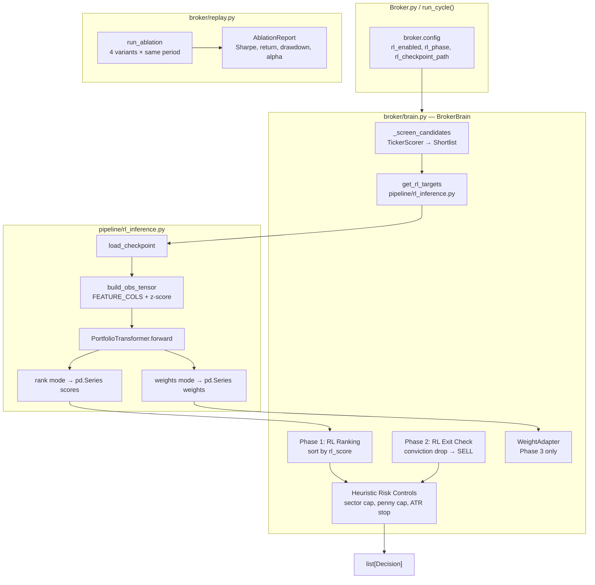

# Design Document: RL Broker Integration

## Overview

This feature bridges the trained `PortfolioTransformer` (PPO walk-forward) into live broker decisions. The broker currently runs a fully heuristic pipeline: screener → composite score → sector allocation → sizing → exits. The RL model is only used in `Agent.py --mode predict/backtest` with zero influence on live trading.

The integration is structured in three phases:

- **Phase 1 (Ranking Controller):** RL scores replace `_composite_score` as the entry ranking signal. Heuristics become diagnostics.
- **Phase 2 (Hold/Exit Influence):** RL conviction drop triggers reduce/exit decisions on held positions.
- **Phase 3 (Weight Controller, future):** RL drives target portfolio weights; broker becomes a pure execution and risk engine.

A hard model-required mode, universe alignment contract, reusable inference wrapper, and four-variant replay ablation framework are all required before Phase 1 is declared complete.

---

## Architecture

### Component Diagram



### Data Flow — Phase 1 Entry Decision

```
load_master(top_n) → df_features [date×ticker, FEATURE_COLS, z-scored]
    │
    ▼
_screen_candidates() → Shortlist [≤100 tickers]
    │
    ▼
get_rl_targets(df_features, shortlist, checkpoint, mode="rank")
    ├── align universe: filter df_features to shortlist tickers
    ├── build obs tensor: (1, lookback, n_assets, n_features)
    ├── PortfolioTransformer.forward() → logits
    └── softmax → rl_scores: pd.Series[ticker → float]
    │
    ▼
sort candidates by rl_score (desc)
    │
    ▼
apply min_score threshold on rl_score
    │
    ▼
sector budget → penny cap → position sizing → Decision(BUY)
```

### Data Flow — Phase 2 Exit Decision

```
Each cycle, for every held ticker:
    get_rl_targets(df_features, [ticker], checkpoint, mode="rank")
        → current_rl_score
    
    entry_rl_score = position["rl_score_at_entry"]
    
    if current_rl_score < rl_exit_threshold → Decision(SELL)
    elif (entry_rl_score - current_rl_score) > rl_conviction_drop → Decision(SELL_PARTIAL)
```

---

## Components and Interfaces

### 1. `pipeline/rl_inference.py` — New File

The inference wrapper is extracted from `Agent.py run_predict()` and generalised.

```python
class ModelNotAvailableError(Exception):
    """Raised when the RL checkpoint cannot be loaded."""

def get_rl_targets(
    df_recent: pd.DataFrame,          # MultiIndex [date, ticker], FEATURE_COLS
    asset_list: list[str],            # ordered tickers to score
    checkpoint_path: str,             # path to .pt file
    mode: str = "rank",               # "rank" | "weights"
    device: torch.device | None = None,
    lookback: int = 20,
) -> pd.Series:
    """
    Load the PortfolioTransformer checkpoint and run a forward pass.

    mode="rank"    → pd.Series[ticker → rl_score ∈ [0,1]]
    mode="weights" → pd.Series[ticker|"CASH" → weight], sum=1.0

    Raises ModelNotAvailableError if checkpoint is missing or corrupt.
    Assigns rl_score=0.0 for tickers with insufficient history.
    """
```

**Internal steps:**
1. Validate `checkpoint_path` exists → raise `ModelNotAvailableError` if not.
2. Load checkpoint; extract `model_cfg`, `top_n`, `model_state`.
3. Instantiate `PortfolioTransformer` with saved config; load state dict.
4. Align `df_recent` to `asset_list` using `FEATURE_COLS` column order.
5. Apply cross-sectional z-score per date (matching `pipeline/data.py` training normalisation).
6. Clip to `[-5.0, 5.0]`.
7. Build obs tensor `(1, lookback, n_assets, n_features)` — pad with zeros for tickers with insufficient history.
8. Call `model.get_weights(obs_t)` → softmax weights `(1, n_assets+1)`.
9. For `mode="rank"`: return asset weights (excluding cash) as scores.
10. For `mode="weights"`: return full weight vector including `"CASH"`.

**Caching:** The loaded model is cached in a module-level dict keyed by `(checkpoint_path, device_str)` to avoid repeated disk I/O across cycles.

---

### 2. `broker/brain.py` — Modified `BrokerBrain`

#### Constructor additions

```python
class BrokerBrain:
    def __init__(
        self,
        ...existing params...,
        rl_enabled: bool = False,
        rl_checkpoint_path: str | None = None,
        rl_phase: int = 1,                    # 1 or 2 (3 = future)
        rl_exit_threshold: float = 0.30,
        rl_conviction_drop: float = 0.20,
    ):
```

#### `run_cycle()` modifications

The cycle order becomes:

```
1. Refresh sector map
2. Validate + update prices
3. [Phase 2] RL exit checks  ← NEW, runs before heuristic exits
4. Heuristic exit checks (stop-loss, take-profit, signal deterioration)
5. Sector scoring
6. Screen candidates → Shortlist
7. [Phase 1] get_rl_targets(shortlist, mode="rank") → rl_scores  ← NEW
8. Sort by rl_score (Phase 1) or composite_score (rl_enabled=False)
9. Apply min_score threshold
10. Sector budget → penny cap → sizing → Decision(BUY)
11. Options (suppressed when rl_enabled=True)
```

#### Hard model-required mode

```python
def _assert_model_available(self) -> None:
    """
    Called at the top of run_cycle() when rl_enabled=True.
    Raises RuntimeError (logged as CRITICAL) if checkpoint is missing
    or architecture mismatches asset_list size.
    Aborts the cycle — no decisions are generated.
    """
```

#### Phase 2 exit check

```python
def _rl_exit_checks(
    self,
    df_features: pd.DataFrame,
    shortlist: list[str],
) -> list[Decision]:
    """
    For each held ticker that appears in the shortlist,
    fetch current rl_score and compare to entry rl_score.
    Returns SELL or SELL_PARTIAL decisions.
    """
```

#### Position metadata extension

When a BUY decision is executed with RL enabled, the position dict gains:

```python
position["rl_score_at_entry"] = float(rl_score)
```

This is stored in `broker/state/portfolio.json` via the existing `Portfolio.save()` mechanism.

---

### 3. `broker/replay.py` — Extended for Ablation

#### New top-level function

```python
def run_ablation(
    df_features: pd.DataFrame,
    price_lookup: pd.DataFrame,
    checkpoint_path: str | None = None,
    initial_cash: float = 10_000.0,
    replay_years: int = 3,
    save_report: str = "plots/ablation_report.csv",
    save_plot: str = "plots/ablation.png",
) -> pd.DataFrame:
    """
    Run all four strategy variants over the same historical period.
    Returns the AblationReport DataFrame and saves CSV + PNG.
    """
```

#### Four strategy variants

| Variant | Screener | Ranking | Sizing |
|---|---|---|---|
| `heuristics_only` | Rule-based `_rank` score | `composite_score` | Conviction from composite |
| `screener_heuristics` | `TickerScorer` | `composite_score` | Conviction from composite |
| `screener_rl` | `TickerScorer` | `rl_score` | Conviction from rl_score |
| `rl_weights` | `TickerScorer` | `rl_weight` | Direct weight → shares |

Each variant calls `run_replay()` with a `strategy` parameter. The `run_replay()` signature gains:

```python
def run_replay(
    df_features: pd.DataFrame,
    price_lookup: pd.DataFrame,
    strategy: str = "heuristics_only",   # NEW
    checkpoint_path: str | None = None,  # NEW
    ...existing params...,
) -> tuple[np.ndarray, list]:
```

#### Ablation gate logic

```python
def _check_ablation_gate(report_df: pd.DataFrame) -> str:
    """
    Returns "PASSED" or "FAILED".
    Gate conditions:
      - screener_rl Sharpe >= heuristics_only Sharpe + 0.10
      - screener_rl max_drawdown <= heuristics_only max_drawdown + 0.05
    """
```

---

### 4. `WeightAdapter` — Phase 3 (Stub)

Located in `pipeline/rl_inference.py` alongside the inference wrapper.

```python
class WeightAdapter:
    """
    Converts RL continuous weight vector into discrete BUY/SELL/HOLD orders.
    Only activated when rl_phase=3. Not used in Phase 1 or 2.
    """

    def __init__(
        self,
        min_weight_threshold: float = 0.01,
        cash_floor: float = 0.05,
    ):

    def adapt(
        self,
        rl_weights: pd.Series,          # ticker → weight, includes "CASH"
        portfolio,                       # Portfolio instance
        sector_map: dict[str, str],
        equity: float,
    ) -> list:                           # list[Decision]
        """
        Diff current weights vs target weights.
        Generate SELL for weight=0, BUY for weight>min_weight_threshold.
        Apply sector cap, penny cap, drawdown circuit breaker.
        """
```

---

### 5. `broker.config` — New Keys

```ini
# RL integration settings
rl_enabled            = false   # set true to activate RL ranking
rl_checkpoint_path    = models/best_fold9.pt
rl_phase              = 1       # 1=ranking, 2=ranking+exits, 3=weights (future)
rl_exit_threshold     = 0.30    # Phase 2: sell if rl_score drops below this
rl_conviction_drop    = 0.20    # Phase 2: sell 50% if score drops by this much
```

---

### 6. `broker/broker.py` — Config Plumbing

The `parse_args()` function gains five new arguments mirroring the config keys above. `BrokerBrain` is instantiated with the new RL parameters passed through.

---

## Data Models

### Observation Tensor

```
shape: (1, lookback, n_assets, n_features)
  lookback   = 20 (matches PortfolioEnv default)
  n_assets   = len(shortlist)  ← dynamic per cycle
  n_features = 19  (len(FEATURE_COLS))
dtype: float32
range: [-5.0, 5.0] (clipped after z-score)
```

The tensor is constructed identically to `Agent.py run_predict()`:
- Outer loop over the last `lookback` dates in `df_recent`
- Inner loop over `asset_list` positions
- Missing ticker/date combinations filled with `0.0`

### RL Score Series

```python
pd.Series(
    data  = [0.0 .. 1.0],   # softmax weight for each asset
    index = asset_list,      # same order as asset_list
    name  = "rl_score",
)
```

For `mode="rank"`, the cash logit is excluded and the remaining asset weights are renormalised to `[0, 1]` by dividing by their sum. This gives a relative conviction score per ticker.

### RL Weight Series (Phase 3)

```python
pd.Series(
    data  = [0.0 .. 1.0],          # sums to 1.0 ± 1e-5
    index = asset_list + ["CASH"],
    name  = "rl_weight",
)
```

### Position Metadata Extension

The existing position dict in `portfolio.json` gains one optional key:

```json
{
  "shares": 12.5,
  "avg_cost": 48.20,
  "last_price": 51.10,
  "partial_taken": false,
  "rl_score_at_entry": 0.073
}
```

`rl_score_at_entry` is `null` for positions opened before RL integration or when `rl_enabled=False`.

### Ablation Report Schema

```python
pd.DataFrame(columns=[
    "strategy",       # str: one of the four variant names
    "total_return",   # float
    "ann_return",     # float
    "sharpe",         # float
    "max_drawdown",   # float
    "win_rate",       # float
    "spy_alpha",      # float: ann_return - spy_ann_return
    "n_trades",       # int
])
```

---

## Correctness Properties

*A property is a characteristic or behavior that should hold true across all valid executions of a system — essentially, a formal statement about what the system should do. Properties serve as the bridge between human-readable specifications and machine-verifiable correctness guarantees.*

